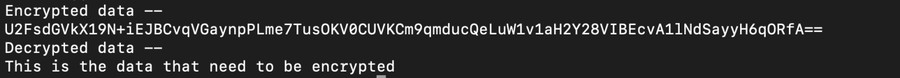

Explain the use of crypto module in Node.js
Last Updated : 03 Mar, 2022
In this article, we will explore the crypto module and what are its uses in Node.js. NodeJS supports a large number of third-party modules. These modules can be used for performing different kinds of tasks. Crypto module is also a 3rd party module that can be imported and used in NodeJS. This module can be used for encrypting, decrypting, or hashing any type of data. This encryption and decryption basically help to secure and add a layer of authentication to the data. The main use case of the crypto module is to convert the plain readable text to an encrypted format and decrypt it when required.

The Crypto and the ByCrypto are the two different 3rd parties module that can be used for the protection of sensitive data. The main difference between the Crypto and ByCrypto is that ByCrypto provides more powerful hashing as that compared to the Crypto module. 

The plain text is in the human-readable form and generally consists of Alphabet and words. After encrypting this text using the Crypto module, it will be changed to a computer-readable format. For Eg: Something like this: sdfasc1asT67W2sqWwsdfsadf

Cryptography Mechanism:

`Hashing`: In this mechanism, a series of plain text is basically converted to Ciphertext. This is a `one-way` Cryptographic algorithm since we cannot convert this cipher text to plain text again. This method is basically used during the user authentication of Systems while providing Sensitive passwords. Since passwords cannot be stored, these ciphertexts will be stored instead. Some popular hashing algorithms are: `Message Digest 5(MD5), RSA, SHA`, etc are Widely used algorithms for hashing.

`Encryption and Decryption`: In this mechanism, a series of plain text is converted to encrypted text with the help of a secret key and then decrypted using the same key. The encrypted text cannot be converted to the original text without a secret key. This algorithm takes input for encrypted text and the secret key which will return the original text as an output. This mechanism is mostly used in Messaging systems to prevent the network from any type of data leak. Some popular mechanisms are `AES, DES`, etc.

Features: 

Easy to use
Widely used algorithms with multiple options to encrypt and decrypt
Cleaner and Consistent Code
Can be easily integrated with Javascript code in NodeJS
Installing module:
```js
npm install crypto-js --save
```
Example 1: Using SHA256 from crypto-js module.

Javascript
Javascript


```js
// Importing module
var SHA256 = require("crypto-js/sha256");
  
// Initializing the original data
var originalData = "Welcome To GeeksForGeeks"
  
// Hashing the Original data
var hasheddata = SHA256(originalData).toString()
  
// Printing hashed data
console.log("Hashed Data is: " + hasheddata)
Output: 

Hashed Data is: ecf0cc86124bb4191a1a10f48b1eb2a7b3b3c7aa8c38ac8de8ad6c0a1502b985
Example 2: Using crypto module for encryption and decryption of the data. We can use a single key for the encryption and then use the same key for decryption as well.

Javascript
Javascript


// Importing the crypto module
const crypto=require("crypto-js")
  
// Initializing the original data
var data = "This is the data that need to be encrypted"
  
// Defining the secret key
var key = "pwd@1234"
  
// Encrypting the data using the password key
var encrypted = crypto.AES.encrypt(data, key).toString();
console.log("Encrypted data -- ")
  
// Printing the encrypted data
console.log(encrypted)
console.log("Decrypted data -- ")
  
// Decrypting the data using the same password key
var decrypted = crypto.AES.decrypt(encrypted, key)
  .toString(crypto.enc.Utf8)
console.log(decrypted)
Output:
```


Reference: https://www.npmjs.com/package/crypto-js