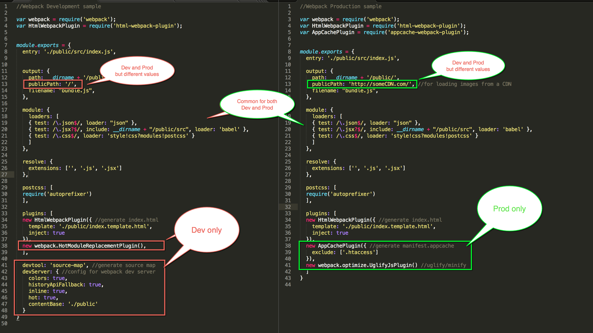
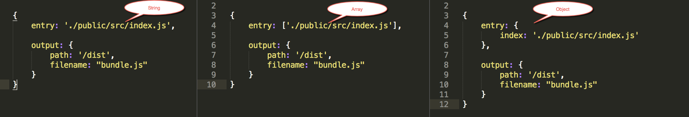
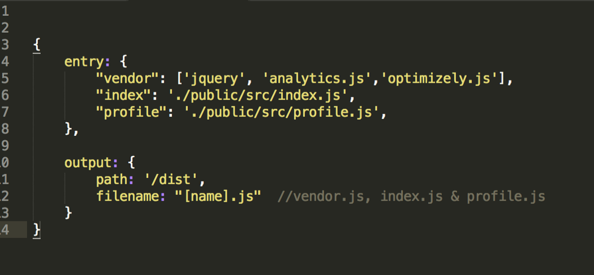
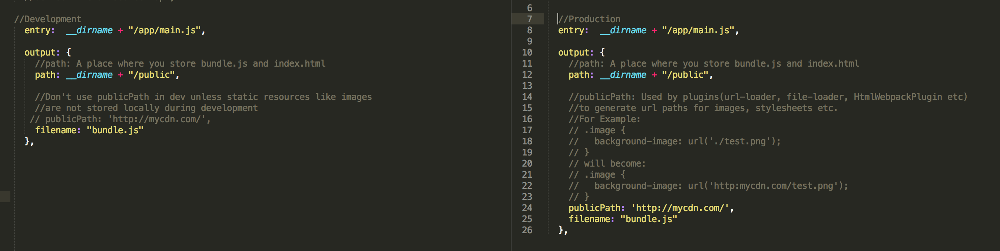
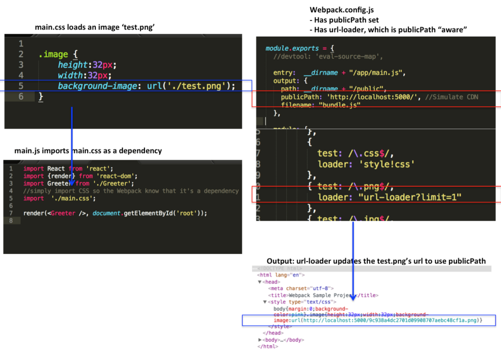
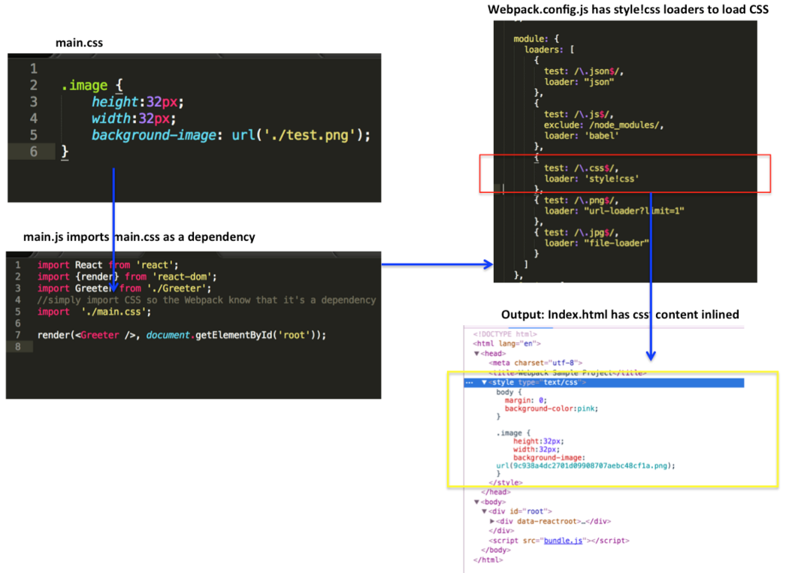
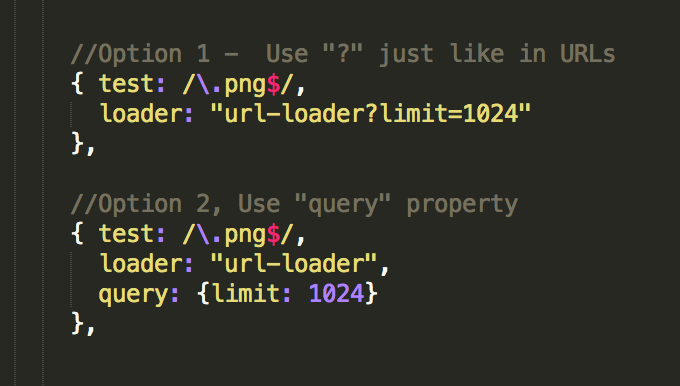

<!--
 * @Author: wangyunbo
 * @Date: 2021-07-12 15:46:30
 * @LastEditors: wangyunbo
 * @LastEditTime: 2021-07-13 09:47:16
 * @Description: file content
 * @FilePath: \dayByday\webpack\webpack.core.md
-->
take forever: to take much more time than you would like

[webpack 详解](https://rajaraodv.medium.com/webpack-the-confusing-parts-58712f8fcad9)
## Webpack’s Core Philosophy

1. `Everything is a module` — Just like JS files can be “modules”, everything else (CSS, Images, HTML) can also be modules. That is, you can `require(“myJSfile.js”)` or `require(“myCSSfile.css”)`. This mean we can split any artifact into smaller manageable pieces, reuse them and so on.

2. `Load only “what” you need and “when” you need` — Typically module bundlers take all the modules and generate a large single output “bundle.js” file. `But in many real-world apps, this “bundle.js” could be 10MB-15MB and could take forever to load!` So Webpack has various features to `split your code` and generate multiple “bundle” files, and also `load parts of the app asynchronously` so that you just load what you need and when you need it.

----------------------

## 1. Development Vs Production

First thing to be aware of is that Webpack has tons of features. Some are for “Development-only”, some others are for “Production-only” and some are for both “Production-and-Development”.


Typically most projects use so many features that they usually have two large Webpack config files.

And to create bundles you’ll write scripts in the `package.json` like so:
```js
“scripts”: {
  //npm run build to build production bundles
  “build”: “webpack --config webpack.config.prod.js”,
  //npm run dev to generate development bundles and run dev. server
  “dev”: “webpack-dev-server”
 }
 ```

 ## 2. webpack CLI Vs webpack-dev-server
It’s important to note that Webpack, the module bundler, provides two interfaces:

- Webpack CLI tool — the default interface (installed as part of Webpack itself)
- webpack-dev-server tool — A Node.js server (You need to install it separately)

### <b>Webpack CLI (Good for Production Builds)</b>
This tool takes options via CLI and also via a config file (default: webpack.config.js) and gives it to the Webpack for bundling.

<b>Usage:</b>
```js
OPTION1:
// install it globally
npm install webpack -g

// Use it at the terminal
$ webpack // <== Generates bundle using `webpack.config.js`

OPTION2:
// install it locally & add it to package.json
npm install webpack --save

// add it to package.json's script
"scripts": {
  "build": "webpack --config webpack.config.prod.js -p"
}

// use it by running the flowwing:
"npm run build"
```

----------------------

### <b>Webpack-dev-server (Good for Development Builds)</b>

This is an Express node.js server that runs at port `8080`. This server internally calls Webpack. The benefit of this is that it provides additional capabilities like reloading the browser i.e. `“Live Reloading”` and/or replacing just the changed module i.e `“Hot Module Replacement” (HMR)`.

<b>Usage:</b>

```js
OPTION 1:
//Install it globally
npm install webpack-dev-server --save
//Use it at the terminal
$ webpack-dev-server --inline --hot
OPTION 2:
// Add it to package.json's script 

“scripts”: {
 “start”: “webpack-dev-server --inline --hot”,
 ...
 }
// Use it by running 
$ npm start
Open browser at:
http://localhost:8080
```

-----------------
-----------------
## Webpack Vs webpack-dev-server options

It’s worth noting that some of the options like “inline” and “hot” are webpack-dev-server only options. Where as some others like “hide-modules” are CLI only options.

## webpack-dev-server CLI options Vs config options
The other thing to note is you can pass options to webpack-dev-server in two ways:

- Through webpack.config.js’s “devServer” object.
- Through CLI options.
```js
//Via CLI
webpack-dev-server --hot --inline
//Via webpack.config.js
devServer: {
 inline: true,
 hot:true
 }
 ```

 I’ve found that sometimes the devServer config (hot:true and inline:true) doesn’t work! So I prefer just passing options as CLI options within package.json like so:
 ```js
 //package.json
{
scripts: 
   {“start”: “webpack-dev-server --hot --inline”}
}
```
Note: Make sure you are not passing hot:true and -hot both together.

## “hot” Vs “inline” webpack-dev-server options

“inline” option adds “Live reloading” for the entire page. “hot” option enables “Hot Module Reloading” that tries to reload just the component that’s changed (instead of the entire page). If we pass both options, then, when the source changes, the webpack-dev-server will try to HMR first. If that doesn’t work, then it will reload the entire page.
```js
//When the source changes, all 3 options generates new bundle but,
 
//1. doesn't reload the browser page
$ webpack-dev-server
//2. reloads the entire browser page
$ webpack-dev-server --inline
//3. reloads just the module(HMR), or the entire page if HMR fails
$ webpack-dev-server  --inline --hot
```

---------------------

## 3. “entry” — String Vs Array Vs Object
`Entry` tells the Webpack where the root module or the starting point is. This can be `a String, an Array or an Object`. This could confuse you but the different types are used for different purposes.

If you have a single starting point (like most apps), you can use any format and the result will be the same.


### entry — Array
But, if you want to append multiple files that are NOT dependent on each other, you can use the Array format.

For example: you may need “googleAnalytics.js” in your HTML. You can tell Webpack to append it to the end of the bundle.js like so:


### entry — object

Now, let’s say you have true `multi-page application`, not a SPA w/ multi-views, but with `multiple HTML files (index.html and profile.html)`. You can then tell Webpack to `generate multiple bundles` at once by using `entry object`.

The below config will generate two JS files: `indexEntry.js and profileEntry.js` that you can use in index.html and profile.html respectively.

<b>Usage:</b>
```js
//profile.html
<script src=”dist/profileEntry.js”></script>
//index.html
<script src=”dist/indexEntry.js”></script>
```
Note: The name of the file comes from the “entry” object’s keys.

## entry — combination

You can also use the Array type entries inside an entry object. For example the below config will generate 3 files: vendor.js that contains three vendor files, an index.js and a profile.js.


## <b>4. output — “path” Vs “publicPath”</b>
`output` tells the Webpack where and how to store the resulting files. It has two properties `“path” and “publicPath”` that could be confusing.

“path” simply tells the Webpack where it should store the result. Where as `“publicPath”` is used by several Webpack’s plugins to update the URLs inside CSS, HTML files when generating production builds.


For example, in your CSS, you may have a url to load ‘./test.png’ on your localhost. But in production, the ‘test.png’ might actually be located at a CDN while your node.js server might be running on Heroku. So that means, you’ll have to manually update the URLs in all the files to point to the CDN when running in Production.

Instead, you can use Webpack’s `publicPath` and use bunch of plugins that are publicPath-aware to automatically update URLs when generating production builds.


```js
// Development: Both Server and the image are on localhost
.image { 
  background-image: url(‘./test.png’);
 }
// Production: Server is on Heroku but the image is on a CDN
.image { 
  background-image: url(‘https://someCDN/test.png’);
 }
 ```

 ## 5. Loaders And Chaining Loaders
 
 Loaders are additional node modules that help `‘load’ or ‘import’` files of various types `into browser acceptable formats` like `JS, Stylesheets` and so on. Further loaders also `allow importing such files into JS via “require” or “import” in ES6`.

 For example: You can use babel-loader to convert JS written in ES6 to browser acceptable ES5 like so:

 ```js
 module: {
 loaders: [{
  test: /\.js$/, ←Test for ".js" file, if it passes, use the loader
  exclude: /node_modules/, ←Exclude node_modules folder
  loader: ‘babel’ ←use babel (short for ‘babel-loader’)
 }]
 ```

 ## Chaining Loaders ( works right to left)
 Multiple Loaders can be chained and made to work on the same file type. The chaining works `from right-to-left` and the loader are separated by `“!”`.

 For example, Let’s say we have a CSS file “myCssFile.css” and we want to dump it’s content into `<style>CSS content</style>` tag inside our `HTML`. We can accomplish that using two loaders: `css-loader` and `style-loader`.

 ```js
 module: {
 loaders: [{
  test: /\.css$/,
  loader: ‘style!css’ <--(short for style-loader!css-loader)
 }]
 ```
 <b>Here is how it works:</b>


1.  `Webpack` searches for CSS files dependencies inside the modules. That is Webpack checks to see if a JS file has “require(myCssFile.css)”. If it finds the dependency, then the Webpack gives that file first to the “css-loader”

2. `css-loader` loads all the CSS and CSS’ own dependencies (i.e @import otherCSS) into JSON. Webpack then passes the result to “style-loader”.

3. `style-loader` to take the JSON and add it to a style tag — <style>CSS contents</style> and inserts the tag into the index.html file.

## 6. Loaders Themselves Can Be Configured

Loaders themselves can be configured to work differently by passing parameters.


In the example below, we are configuring `url-loader` to use DataURLs for images less than 1024 bytes and use URL for images that are larger than 1024 bytes. We can do this by passing “limit” parameter in the following two ways:


## 7. The .babelrc file
babel-loader uses “presets” configuration to know how to convert ES6 to ES5 and also how to parse React’s JSX to JS. We can pass the configuration via “query” parameter like below:
```js
module: {
  loaders: [
    {
      test: /\.jsx?$/,
      exclude: /(node_modules|bower_components)/,
      loader: 'babel',
      query: {
        presets: ['react', 'es2015']
      }
    }
  ]
}
```

However in many projects babel’s configuration can become very large. So instead you can keep those them in babel-loader’s configuration file called `.babelrc` file. `babel-loader` will `automatically load the .babelrc` file if it exists.
So in many examples, you’ll see:

```js
// webpack.config.js
module: {
  loaders: [
    {
      test: /\.jsx?$/,
      exclude: /(node_modules|bower_components)/,
      loader: 'babel'
    }
  ]
}

// .babelrc
{
  "presets": ["react", "es2015"]
}
```

## 8.Plugins
<b>Plugins are additional node modules that usually work on the resulting bundle.</b>

For example, `uglifyJSPlugin` takes the `bundle.js` and `minimizes` and `obfuscates` the contents to `decrease the file size`

Similarly `extract-text-webpack-plugin` internally uses `css-loader and style-loader` to gather all the CSS into one place and finally `extracts` the result into a separate external `styles.css` file and includes the link to `style.css into index.html`

```js
//webpack.config.js
//Take all the .css files, combine their contents and it extract them to a single "styles.css"
var ETP = require("extract-text-webpack-plugin");

module: {
 loaders: [
  {test: /\.css$/, loader:ETP.extract("style-loader","css-loader") }
  ]
},
plugins: [
    new ExtractTextPlugin("styles.css") //Extract to styles.css file
  ]
}
```

Note: If you want to just inline CSS as a style element into HTML, you can do that without the `extract-text-webpack-plugin` and by just CSS and Style loaders like below:
```js
module: {
 loaders: [{
  test: /\.css$/,
  loader: ‘style!css’ <--(short for style-loader!css-loader)
 }]
``` 

## 9. Loaders Vs Plugins

As you might have realized, Loaders work at the individual file level during or before the bundle is generated.

Where as Plugins work at bundle or chunk level and usually work at the end of the bundle generation process. And some Plugins like commonsChunksPlugins go even further and modify how the bundles themselves are created.

## 10. Resolving File Extensions

Many Webpack config files have a `resolve extensions` property that has `an empty string` like shown below. `The empty string is there to help resolve imports without extensions like: require(“./myJSFile”) or import myJSFile from ‘./myJSFile’ without file extensions.`

```js
{
 resolve: {
   extensions: [‘’, ‘.js’, ‘.jsx’]
 }
}
```